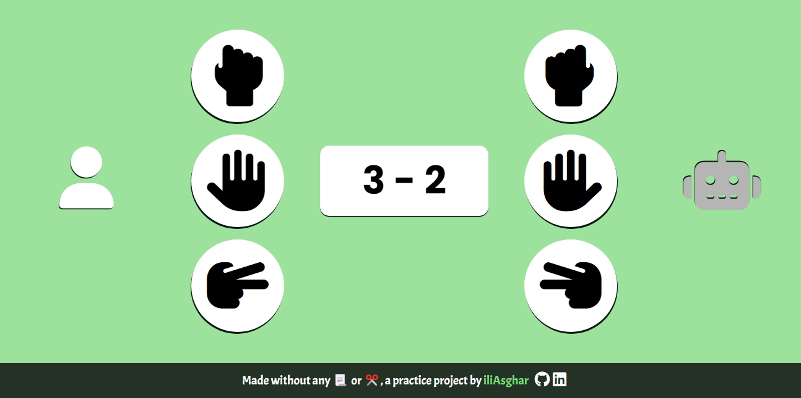

# Rock! Paper! Scissors!

## Table of Contents
- [Description](#description)
- [Project Goals](#project-goals)
- [Screenshots](#screenshots)
- [Links](#links)
- [What I Learned](#what-i-learned)
- [Future Improvements](#future-improvements)
- [Author](#author)

## Description
this project is a practice project implementing a simple version of Rock Paper Scissors.

## Project Goals
with this project i wanted to improve my coding skills and practice using JS

## Screenshots

## Links
- [Live Demo](https://iliasghar.github.io/Rock-Paper-Scissors/)
- [GitHub Repository](https://github.com/iliAsghar/Rock-Paper-Scissors)

## What I Learned
this was a good learning opportunity since i am learning JS . this practice helped me reinforce my knowledge a bit.

## Future Improvements
for future developments, i would like to have a 'TBBT' version of it :D (Rock, Paper, Scissors, Lizard, Spock)

## Author
- AliAsgharZare (iliAsghar)
